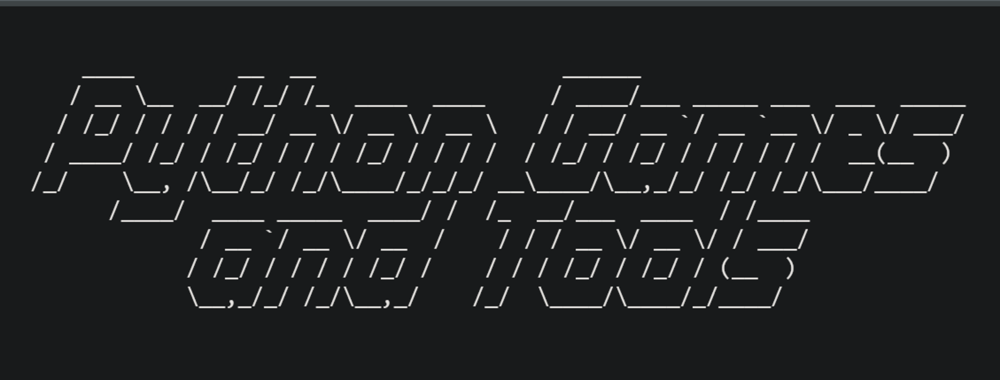

  

<h1 align="center">Beginner python tools and games</h1>
  
<!-- Table of Contents -->
<!-- Please update when you're contributing -->

<!-- <li><a href="/Name of your folder">Name of your game</a></li> -->

    
<h2>Table of Contents</h2>

  <ol.s>
    <h3>Games</h3>
      <li><a href="/Games/auction">Auction</a></li>
      <li><a href="/Games/black_jack">BlackJack</a></li>
      <li><a href="/Games/slot_machine">Slot Machine</a></li>
      <li><a href="/Games/board_filling_game">Board filling game</a></li>
      <li><a href="/Games/state_guessing">US states guessing</a></li>
      <li><a href="/Games/minesweeper">Minesweeper</a></li>
      <li><a href="/Games/hangman">Hang Man</a></li>
      <li><a href="/Games/rock_paper_scissors">Rock Paper Scissor</a></li>
      <li><a href="/Games/guess_the_number">Guess the number</a></li>
      <li><a href="/Games/tic_tac_toe">Tic-Tac-Toe</a></li>
      <li><a href="/Games/road_crossing">Road crossing</a></li>
      <li><a href="/Games/pong">Pong</a></li>
      <li><a href="/Games/turtle_racing_bet">Turtle racing bet</a></li>
      <li><a href="/Games/snake_game">Snake game</a></li>
      <li><a href="/Games/etch_a_sketch">Etch A Sketch</a></li>
    <h3>Tools</h3>
      <li><a href="/Tools/encoding">Encoding</a></li>
      <li><a href="/Tools/calculator">Calculator</a></li>
      <li><a href="/Tools/NATO_alphabet_translator">NATO Alphabet Translator</a></li>
      <li><a href="/Tools/distance_calculator">Distance Conversion Calculator</a></li>
   </h3>
  </ol.s>

  

## :eyes: About The Project
This is a beginner friendly **open source** project where developers build, play, or even learn various games and tools built with Python!
  

## :mushroom: Installation

:rice_ball: Clone the repo `git clone git@github.com:AseanK/beginner-python-tools-and-games.git`

:rice_ball: Head to the game folder you want to play

:rice_ball: Run the file using python command `python name_of_the_game/tool.py`
   

## :sparkles: Contribute

Contributions are what make the open source community such an amazing place to learn, inspire, and create. Any contributions you make are **greatly appreciated**.

Please create a simple README.md file using provided template!

If you have a suggestion that would make this better, please fork the repo and create a pull request. You can also simply open an issue with the tag "enhancement".
Don't forget to give the project a star! Thanks again!

:rice_ball: Fork the Project
    
    
:rice_ball: Clone the repo `git clone git@github.com:AseanK/beginner-python-tools-and-games.git`

:rice_ball: Create your own Branch (`git checkout -b Name_of_your_game`)

:rice_ball: Commit your Changes (`git commit -m 'Comments'`)

:rice_ball: Push to the Branch (`git push origin Name_of_your_game`)

:rice_ball: Open a Pull Request

## :raised_hands: Contributors

### 🙏 Thank you! 
