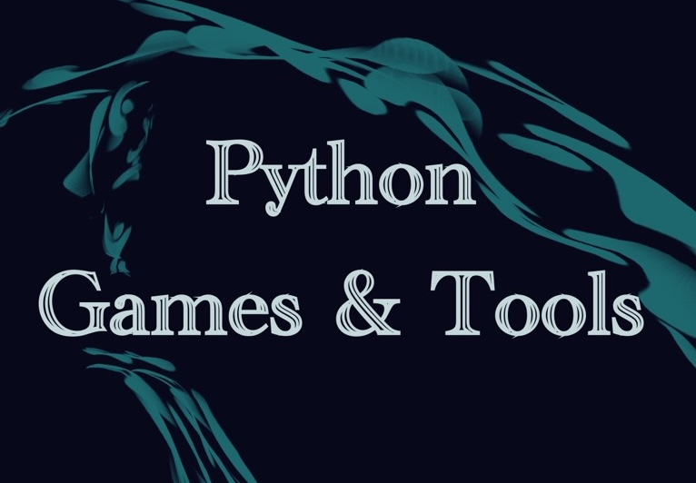

<h1 align="center">Python Tools and Games</h1>
<br /><br />

<!----------------Badge-------------->

<div align="center">

 <a href="https://github.com/AseanK/python-tools-and-games/issues" target="_blank">
 <a href="https://github.com/AseanK/python-tools-and-games/issues" target="_blank">
 <a href="https://github.com/AseanK/python-tools-and-games/issues" target="_blank">

</div>
<!----------------Badge END-------------->
  
<p align="center">
  <a href="https://github.com/AseanK/python-tools-and-games" target="_blank">
    
  </a>
</p>

  <!----------------Badge-------------->
<div align="center">
 


[](https://opensource.org/licenses/MIT)
</div>
  <!----------------Badge END-------------->

## Table of Contents

[Getting Started](#getting-started)

[Contributing](#contributing)

<details>
<summary><strong>Games</strong></summary>

- [Auction](/Games/auction)
- [BlackJack](/Games/black_jack)
- [Slot Machine](/Games/slot_machine)
- [Board filling game](/Games/board_filling_game)
- [US states guessing](/Games/state_guessing)
- [Minesweeper](/Games/minesweeper)
- [Hang Man](/Games/hangman)
- [Rock Paper Scissors](/Games/rock_paper_scissors)
- [Guess the number](/Games/guess_the_number)
- [Tic-Tac-Toe](/Games/tic_tac_toe)
- [Road crossing](/Games/road_crossing)
- [Pong](/Games/pong)
- [Turtle racing bet](/Games/turtle_racing_bet)
- [Snake game](/Games/snake_game)
- [Etch A Sketch](/Games/etch_a_sketch)
- [CompSci Quiz](/Games/comp_sci_quiz)
- [Treasure Island](Games/treasure_Island)
- [Pizza Palour](Games/pizza_palour)
- [Checkers](Games/checkers)
- [General Quiz Game](<Games/General Quiz Game>)
- [Ludo King](Games/ludo_king)

</details>

<details>
<summary><strong>Tools</strong></summary>

- [Encoding](/Tools/encoding)
- [Calculator](/Tools/calculator)
- [NATO Alphabet Translator](/Tools/NATO_alphabet_translator)
- [Distance Conversion Calculator](/Tools/distance_calculator)
- [Pomodoro Timer](/Tools/pomodoro_timer)
- [Kanye Says...](/Tools/kanye_says)
- [Cookie Macro](/Tools/cookie_macro)
- [QRcode Generator](/Tools/qrcode_gen)
- [Tip Calculator](/Tools/tip_calculator)
- [Auto WiFi Check](/Tools/AutoWiFiCheck)
- [PDF Merge](Tools/merge_pdf)
- [Text Summarizer](Tools/text_summarizer)
- [Image Resizer](Tools/Image_resizer)
- [Remove Duplicates](Tools/remove_duplicates)
- [Password Strength Checker](Tools/Password_strength_checker)
- [Bluetooth Scanner](Tools/bluetooth_scanner)

</details>

<br /><br />

## 👀About The Project

🎮 Welcome to the **Awesome Open Source** Python Games and Tools repository! 🛠️

This curated collection of open source games and tools is specifically designed to empower beginners in their journey to learn and explore Python programming. 🌟 We strongly encourage contributions from the community to enrich this repository with new games, tools, and improvements.
<br /><br />

## 🍄Getting Started

To get started, you'll need to have Python installed on your machine. You can download Python from the official website: [python.org](https://www.python.org/).

Once Python is installed, you can take the following steps:

### Step 1

- Clone the repository using either of the following commands:

```bash
git clone git@github.com:AseanK/python-tools-and-games.git
```

or

```bash
git clone https://github.com/AseanK/python-tools-and-games.git
```

### Step 2

- Now you can explore the games and tools provided in the repository.
- After cloning the repository, navigate to the project directory:

```bash
cd "<Name_of_the_folder>"
```

### Step 3

- Run the file using python command

```bash
python "<Name_of_the_game/tool>.py"
```

<br />

## ✨Contributing

Contributions are what make the open source community such an amazing place to learn, inspire, and create. Any contributions you make are **greatly appreciated**.
We welcome contributions from everyone! If you have an idea for a new game or tool, or if you want to improve the existing ones, please follow these steps:

### Step 1

- Fork the repository:
  

### Step 2

- Clone the repository:

```bash
git clone git@github.com:AseanK/beginner-python-tools-and-games.git
```

or

```bash
git clone https://github.com/AseanK/python-tools-and-games.git
```

### Step 3

- Create a new branch for your feature or improvement:

```bash
git checkout -b <Name_of_your_game>
```

### Step 4

- Make your changes and commit them with descriptive messages:

```bash
git commit -m '<Comments>'
```

### Step 5

- Push your changes to your forked repository:

```bash
git push origin <Name_of_your_game>
```

### Step 6

- Submit a pull request to the main repository.
  <br />

Please create a simple README.md file using provided template!

If you have a suggestion that would make this better, please fork the repo and create a pull request. You can also simply open an issue with the tag "enhancement".
Don't forget to give the project a star! Thanks again!

## :raised_hands: Contributors

<a href="https://github.com/AseanK/python-tools-and-games/graphs/contributors">
  
</a>

<br />
<h4 align="center"> 🙏 Thank you! 🙏 </h4>
