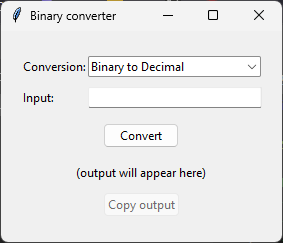
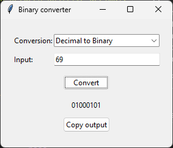

# Binary converter

Binary-decimal-hexadecimal-ASCII conversion program with a simple Tkinter GUI.

## Features:
* Conversion between positive decimal, binary and hexadecimal integers
* Inversion of binary digits
* Conversion between binary code and text
* GUI à la Copilot

## Potential improvements:
- [ ] Add support for negative integers
- [ ] Add support for floating point numbers
