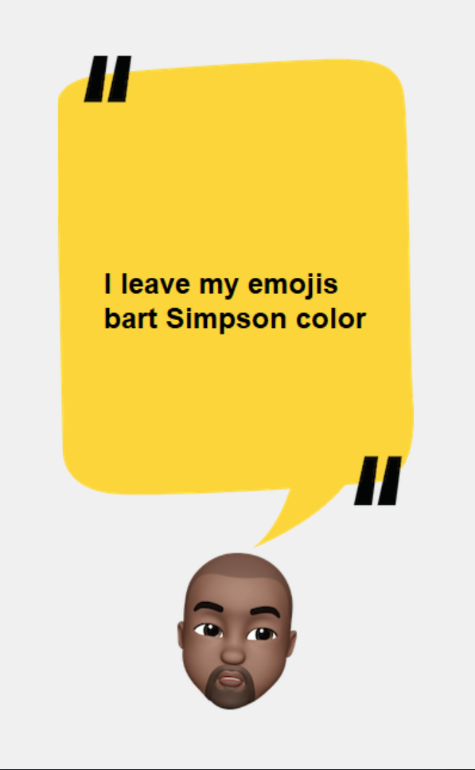

  

# Kanye Say...
<!-- Tools features -->
## Features
1. Your daily Kanye West Quotes.
2. Click the Kaynye icon for your daily quote.

## How to install and run
1. Fork the repo by clicking the fork logo on the top right 
2. Clone the repo `git clone git@github.com:AseanK/beginner-python-tools-and-games.git`
3. Head to the kanye_says folder
4. Run the file using python command `python main.py`