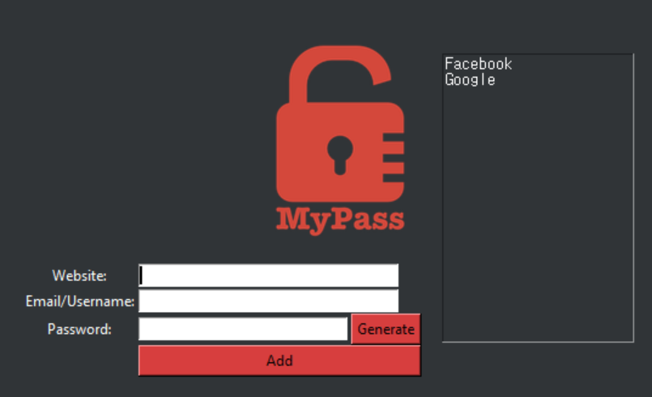

  

# Password Manager
<!-- Tools features -->
## Features
1. Password Manager generates random strong password for you
2. The saved data is stored locally in `json` file
3. Displays saved websites on the right
4. Fetch selected data and displays on pop-up

## Screenshot

## How to install and run
1. Fork the repo by clicking the fork logo on the top right 
2. Clone the repo `git clone git@github.com:AseanK/beginner-python-tools-and-games.git`
3. Head to the password_manager folder
4. Run the file using python command `python main.py`