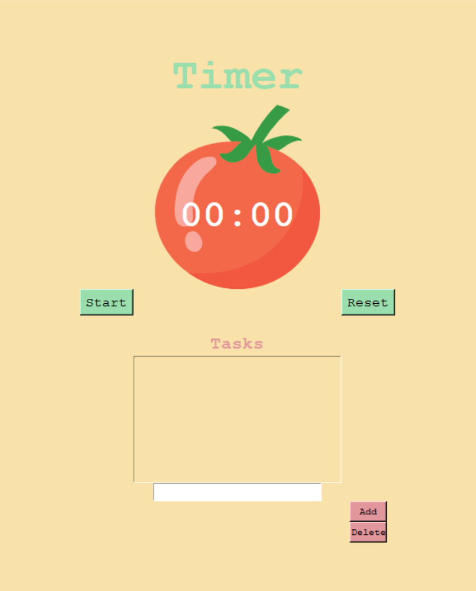

  

# Pomodoro Timer
<!-- Tools features -->
## What is the Pomodoro Technique?
1. The Pomodoro Technique is a time management method based on 25 miniute streches of focused work broken by 5 mintue breaks
2. It was developed in the late 1980s by Francesco Crillo
3. It is highly effective as it helps you effectively manage your time and work on a task without distractions. It is also beneficial as it helps you become more disciplined and think about your work. This technique is designed to combat multitasking and improve concentration.

## Features

## How to install and run
1. Fork the repo by clicking the fork logo on the top right 
2. Clone the repo `git clone git@github.com:AseanK/beginner-python-tools-and-games.git`
3. Head to the pomodoro_timer folder
4. Run the file using python command `python main.py`