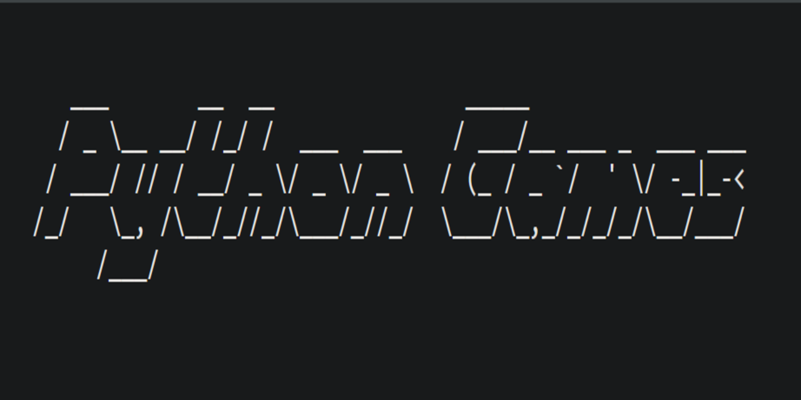
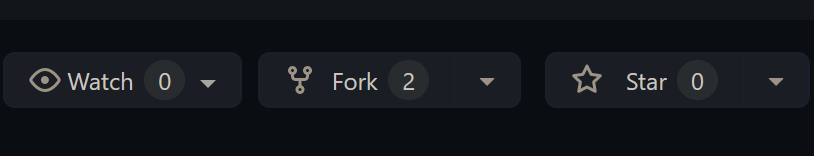

  

# Board filling game

## Rules
1. Enter coordinates to put the pieces on the board.
2. Try to fill the board in as few rounds as possible.
3. Enter (0, 0) to skip the round.

## How to play
1. Fork the repo by clicking the fork logo on the top right 
2. Clone the repo `git clone git@github.com:AseanK/beginner-python-games.git`
3. Head to the board_filling_game folder
4. Run the file using python command `python board_filling_game.py`

